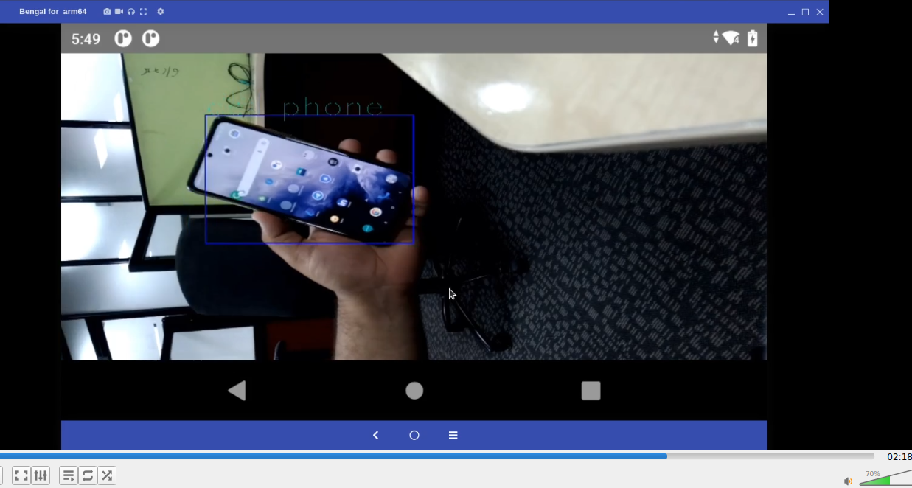
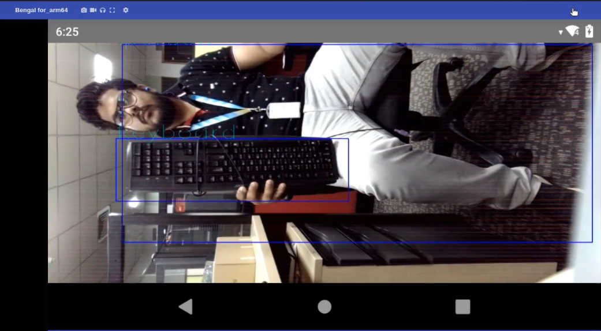
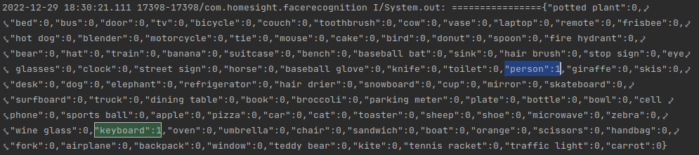
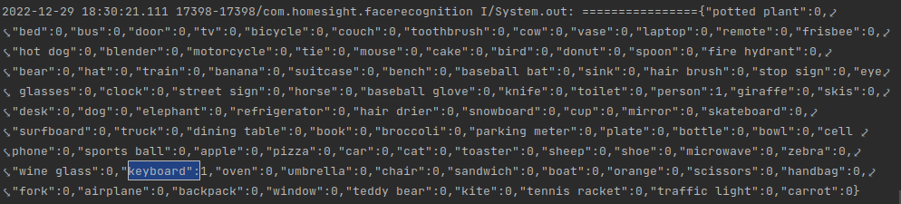
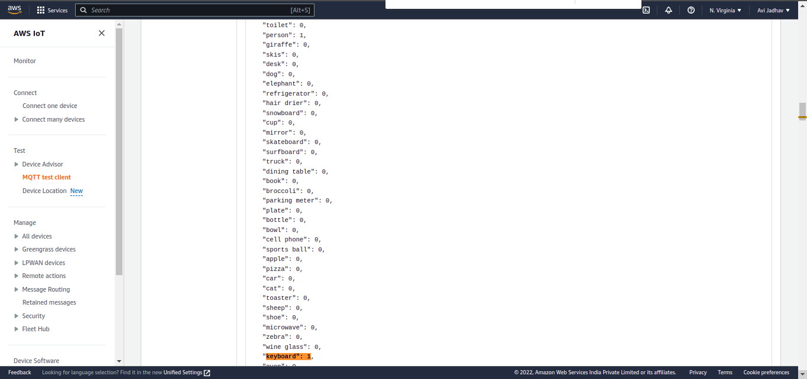
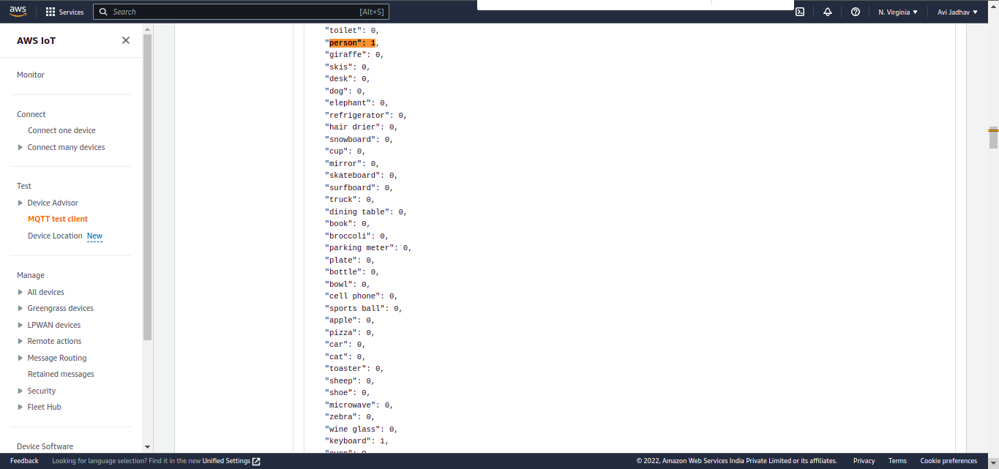

# AWS-IOT-Integration-for-Object-Detection-using-CM2290-on-Android
## Description: 
The goal of this project is to develop an AI-powered application that can detect various objects and send the detected data to AWS IoT services. This application will be built for the Android platform and will be integrated with the Thundercomm TurboX CM2290 LA (Linux Android) Development Kit, enabling us to deploy AI camera applications on edge devices. Overall, this project represents an exciting opportunity to combine cutting-edge technologies and push the boundaries of what is possible with AI and the IoT. .

## Prerequisites:  
- Download the Android Studio based on host system.
	https://developer.android.com/studio?gclsrc=aw.ds 
- Download and Install the Application Tool chain SDK. (Setup instructions can be found in Application SDK User Manual).
	https://www.thundercomm.com/product/cm2290-c2290-development-kit/
- AWS Account For user pool and identity pool) 
- Download AWS ioT device  SDK for android 
- Setup the SNPESDK in the host system, download SNPE SDK here and select Tools and Resources and Download version 1.51. 


## Follow the steps to setup all things:
### Get the Endpoint for AWS MQTT client:  To access the AWS IoT platform and retrieve the necessary endpoint information, follow these steps: 
- Log in to the AWS Console. 
- Search for the IoT Core services in the search box. 
- On the left side of the screen, find the 'Settings' option and open it. 
- In the 'Device Data Endpoint' section, copy the endpoint. 
		
You will need to use this endpoint in the Android app for further configuration. Make sure to keep this endpoint handy and do not share it with unauthorized parties, as it is a crucial component of your AWS IoT setup 

## AWS Account For user Cognito pool ID:
	Create a user pool(Setting):
	setup user pool for secure login using Cognito follow the steps below:
		1. Go to https://console.aws.amazon.com/cognito/
		2. Click `Manage User Pools`
		3. Click `Create a user pool`
		4. Fill-in `Pool name`
		5. Click `Review defaults`
		6. Click `Create user pool`
		7. Copy `Pool Id`
		8. Select `App clients` in the left navigation.
		9. Click `Add an app client`
		10. Fill-in `App client name`
		11. Click `Create app client`
		12. Click `Show details` and copy `App client id` and `App client secret` 
		
These values will be used to authenticate and authorize your app to access the AWS resources that it needs. Make sure to keep them secure and do not share them with unauthorized parties. 

## Steps to build and deploy the application:
- Clone the project on the host system. 
```bash
$ git clone <source repository>  
$ cd Object_detection_with_IOT_Android_App/ 
```
- Launch Android studio by executing ‘studio.sh’ file (for Linux user). 
```bash
       <android_studio_directory>/bin $ ./studio.sh 
```
- From the file menu open the folder of cloned Android application source. 
- After opening the Object_detection_with_IOT_Android_App in Android studio select the SDK Manager icon in that select SDK Tools and check the Show Package Details. 
- In the NDK section select version 17.2 version and CMake of 3.18.1 and click on apply. This will download the Android NDK and CMake required by SNPE SDK. 
- Go to ‘CMakeLists.txt’ file and make the following changes for setting up OPENCV_DIR and include directories of SNPE SDK. 
```bash
1.set(OpenCV_DIR "<opencv_directory>/opencv-4.5.4-android-sdk/OpenCV-android-sdk/sdk/native/jni").

2.include_directories(<SNPE_ROOT>/include/zdl) 
```
- Copy the intermediates library from  <Project_name/app/build/intermediates/cmake/debug/obj/armeabi-v7a> to <project_name/app/src/main/jniLibs/armeabi-v7a > 
- Replace the content which shows < REPLACE REQUIRED VALUE HERE > in file AWSConfigConstant with your aws mqtt  endpoint and Cognito pool ID 

- AWSConfigConstant file is present at app/src/main/java path. 

##  Add the following dependencies in build.gradle:

```bash
implementation 'com.amazonaws:aws-android-sdk-iot:2.49.0' 
implementation 'com.google.android.material:material:1.4.0' 
implementation 'androidx.constraintlayout:constraintlayout:2.1.2' 
testImplementation 'org.junit.jupiter:junit-jupiter' 
androidTestImplementation 'androidx.test.ext:junit:1.1.3' 
androidTestImplementation 'androidx.test.espresso:espresso-core:3.4.0'
```
## Steps to Run on CM2290 with SNPE on Android Application: Before running the application set the board environment by following below steps:

1. Connect kit to the host system, enter following adb commands 

```bash
$adb disable-verity  
$adb reboot 
$adb root 
$adb remount 	 
```
2.Turn on Wifi in android kit. Select the available Wifi by entering password. 

3.Set the latest UTC time and date in setting->Date and time setting. 

4.Copy the Library files of snpe 1.51 	on to the kit from host system. 
```bash
$adb push <SNPE_ROOT>/lib/arm-android-clang6.0/ /system/lib/ 	
```
5.Copy the DSP files of snpe 1.51 on to the kit from host system. 
```bash
$adb push <SNPE_ROOT>/lib/dsp/system/vendor/lib/rfsa/adsp/ 
```           
6.Copy the libcdsprpc.so file from “/vendor/lib” folder to “/system/lib” folder 
```bash
$adb shell 
$cp /vendor/lib/libcdsprpc.so ./system/lib/  
```

## Steps to build and run application using ADB: 
1.Connect the target device to host machine using C to USB cable 
2.Once Device is connected allow the usb debugging in target device:
- Go to setting of target device 
- Click to developer mode option 
- search for USB debugging option and ON it 

3.Once USB debugging is ON your target device is get connect to host machine    and available in android studio devices list. 

4.Now you can directly run app on target device. 


## Steps for run the main application are as follows:

1.First subscribe the topic name as given in app on aws iot platform to do that follow the steps : 
 - login into AWS console 
 - search for iot core in search box and open it 
 - Left panel click on MQTT test client 
 - subscribe the same  topic as given in APP 

2.Go to android studio and generate APK file for Object_detection_IOT on CM2290 with SNPE on Android. Refer below  steps: 
 - Once the build successful, go to Build menu and select Build  Bundle(s)/APK(s) from the dropdown then select Build APK(s). 
- Above step will download APK file in the following directory. Object_detection_IOT on CM2290 with SNPE on Android /app/build/outputs/apk/debug/app-debug.apk
3. Install APK file on CM2290 kit. 
```bash
$adb install app-debug.apk 
```
4.Open the application on kit. It will open the live camera and start detecting the objects and send data to aws iot cloud. 


# Results of Application and AWS IOT data logs
- Object detection shown in following images : 




- Andrid studio Terminal output , it shows the object and its count, in 1st Screenshot keyboard and person is detected ,so its shows  person:1 & keyboard:1





-Data received at AWS IOT : 






